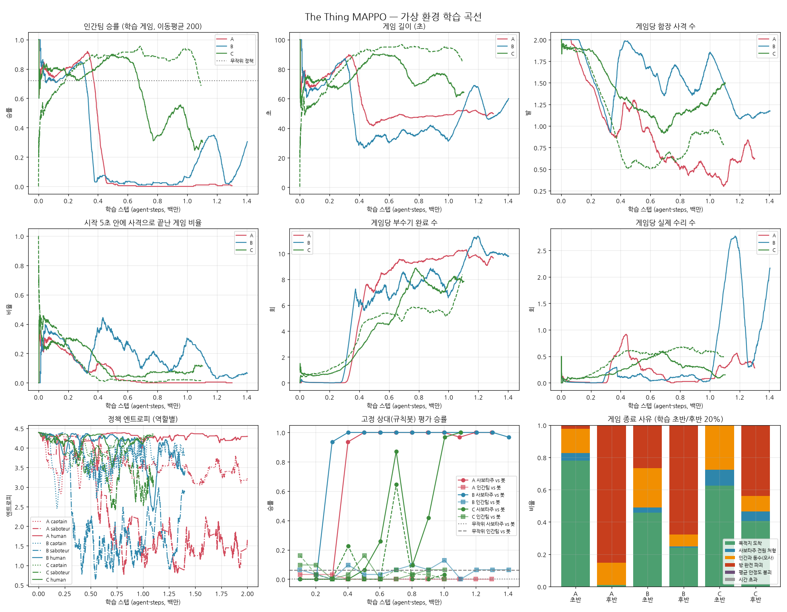

# 가상 환경 학습 실험 보고서

Unity 빌드 없이 게임 로직과 ML-Agents 동작을 파이썬으로 옮긴 시뮬레이터(`sim/thething_sim.py`)에서
`mappo_trainer.py`를 그대로 돌려 학습이 실제로 되는지 확인했다.



## 실험 구성

| 이름 | 내용 | 시드 | 진행량 |
|---|---|---|---|
| A | 수정 전 트레이너 (커밋 `e009fc4` 시점 그대로) | 0 | 2.0M decision (학습 1.3M + 평가 0.7M) |
| B | A + 트레이너 수정 (에피소드 경계, 사망자 보상, 평가 스텝 분리) | 0 | 학습 1.4M |
| C | B + "방 이동 중에는 새 방 선택 무시" (이동 확정) | 0, 1 | 학습 ~1.1M |

- 하이퍼파라미터는 `mappo_trainer.py`의 `CONFIG` 기본값, 밸런스는 `config/TheThing.yaml` 그대로.
- 시드 1의 A·B는 CPU 부족으로 중간에 중단했다(초반 경향은 시드 0과 같았음).
- 평가: 10만 스텝마다 한쪽 팀을 규칙봇(NPCAIBrain 근사)으로 고정하고 팀당 30게임.

기준선 (학습 없음, `baselines.jsonl`):

| 조건 | 인간팀 승률 | 비고 |
|---|---|---|
| 전원 무작위 | 72% | 패배는 전부 함장 오사(인간과 동수) |
| 전원 무작위, 함장 사격 금지 | 100% | 사보타주가 아무것도 못 함, 게임당 부수기 0.17회 |
| 무작위 사보타주 vs 규칙봇 인간팀 | 100% | |
| 무작위 인간팀 vs 규칙봇 사보타주 | 6% | |

## 결론 요약

**학습 파이프라인은 돌아간다. 사보타주 팀은 확실히 학습한다. 인간팀은 학습하지 못한다.**
인간팀이 학습하지 못하는 주원인은 알고리즘이 아니라 게임 밸런스다.

1. **사보타주: 학습됨.** 약 0.35M 스텝에서 "가까운 방 하나에 붙어서 계속 부수기"를 발견한다.
   - 게임당 부수기는 0 → 약 10회, 은닉률은 거의 100%.
   - 규칙봇 인간팀 상대 평가 승률은 0% → 100% (A, B 모두 0.4M 부근에서 전환).
   - 사보타주 정책 엔트로피는 4.39(균등분포) → 1.6(A) / 2.9(B).
2. **인간팀: 학습되지 않음.**
   - 인간 정책 엔트로피는 4.39 → 4.29(A, C)로 사실상 무작위 그대로다.
   - 규칙봇 사보타주 상대 승률은 0~13%로, 무작위 기준선 6%와 구별되지 않는다.
   - 학습 게임 승률은 A에서 0.9%, B에서 25%(마지막 20%, 시드 1개)까지 떨어진다.
3. **함장: "덜 쏘기"만 배운다.**
   - 게임당 사격 수는 2 → 0.6~1.1발로 줄고, 시작 5초 안의 사격(전원이 카페에 모여 있을 때)도 사라진다.
   - 명중률은 무작위(40%)보다 나아지지 않는다. 즉 누가 사보타주인지 추리하는 학습은 일어나지 않았다.

## 왜 인간팀은 학습하지 못하나

### 1. 단순한 사보타주 전략이 게임 규칙상 사실상 필승이다 (`balance_check.txt`)

스크립트 사보타주(가장 가까운 방에서 행동 `(방, 부수기)` 고정) vs 규칙봇 인간팀+함장:
**사보타주 승률 100%, 평균 42초, 인간 수리 0회.**

- 방 하나를 0%로 만들면 즉시 승리한다. 부수기 10회 × 3초에 이동 약 12초를 더하면 약 42초다.
- 방은 사용 중(`isBeingUsed`)이면 다른 캐릭터가 상호작용할 수 없다.
  사보타주가 부수기를 끝내자마자 다시 시작하므로, 인간은 그 방을 **수리조차 못 한다.**
- 위치 알림은 안정도 30% 이하(7회째, 약 33초)에야 뜬다. 그때부터 파괴까지 약 9초뿐인데,
  방 사이 거리는 57~200 유닛(이동 11~40초)이다.
- 남은 대응은 함장의 사격뿐이다. 그런데 사격하려면 함장이 바로 그 방 10 유닛 안에서 부수는 장면을 봐야 한다.

결국 인간팀은 거의 모든 게임에서 지고, 받는 보상은 거의 항상 -5다.
보상의 분산이 없으니 advantage가 0 근처에 머물고, 정책이 개선될 방향이 없다.
인간팀이 이기려면 여러 명이 방을 미리 점유하고, 함장이 따라붙어 사격하는 식의
다단계 협동이 필요하다. 무작위 탐색으로는 사실상 발견할 수 없다.

### 2. 함장이 추리할 근거가 너무 드물다

목격 플래그는 "부수는 장면을 10 유닛 안에서 직접 봄"일 때만 켜진다.
그러나 맵은 약 150×200 유닛이고 사보타주는 사람이 없는 방을 고른다(은닉률 거의 100%).
그래서 함장 관측에 사보타주를 가리키는 정보가 거의 들어오지 않는다.

### 3. 부수기 피해 보상이 너무 작다

부수기 피해 보상(안정도 변화 × 0.01 ÷ 방 8개 ≈ 0.0125)은 승패 ±5보다 400배 작다.
인간팀에게 "방이 깎이고 있다"는 학습 신호가 사실상 없다.

## 트레이너 버그 (실험 A에서 발견, B에서 수정)

1. **사망 시 에피소드를 잘라버림**
   - ML-Agents는 비활성화된 에이전트의 terminal을 다음 physics step에 decision 없이 단독으로 보낸다.
   - 트레이너는 `len(decision_steps)==0 and len(terminal_steps)>0`를 에피소드 종료로 보고, 게임 도중에 `env.reset()`을 불렀다.
   - A에서 트레이너가 센 에피소드는 3,917개였지만 실제 게임은 2,538개였다. B에서는 3,509 = 3,510으로 일치한다.
2. **죽은 에이전트의 승패 보상 유실**
   - 게임 종료 때 죽은 에이전트를 재활성화하면 `LazyInitialize`로 **새 episode id**가 발급된다.
   - 그래서 ±5 보상이 버퍼가 없는 id로 가서 버려졌다.
   - 이 id가 리셋 후 관측으로 역할 등록까지 되어 `reward/<role>` 지표를 오염시켰다(A의 사보타주 보상 상위 5%가 +9.2로, 실제로는 나올 수 없는 값).
3. **승률 지표가 보상 부호로 계산됨** → Unity의 `outcome/human_win` 통계로 교체했다.
4. **평가 스텝이 학습 예산을 소모함** → A에서는 2M 중 약 0.7M(35%)이 평가였다.

수정 후(B) 차이 (시드 1개라 확정적이지 않음):

| 지표 | A | B |
|---|---|---|
| 인간 수리/게임 (마지막 20%) | 0.34 | 1.9 |
| 인간 정책 엔트로피 | 4.29 | 3.4 |
| 함장 명중률 | 2.7% (무작위 40%보다도 낮은 비정상 값) | 36.5% |

## 이동 확정(C) 실험

"0.4초마다 목적지가 바뀌어 방에 도착하지 못하는 탐색 문제" 가설을 검증하려고 넣었다.

- 무작위 정책의 게임당 부수기는 0.17 → 1.29회로 늘었다.
- 그러나 A·B도 0.35M 스텝 안에 "같은 방 계속 고르기"를 스스로 학습했다. 이 가설은 **결정적 원인이 아니었다.**
- 오히려 C는 사보타주 학습이 더 늦고 불안정했다(시드 0은 1.1M에서 전환, 시드 1은 미전환).
- 이동 중 취소가 불가능해져 행동 하나의 효과가 길어지고, 신용 할당이 어려워진 것으로 보인다.
- **도입하지 않는 것을 권장한다.**

## 권장 사항 (우선순위)

1. **게임 밸런스 조정** (인간팀 학습의 전제 조건)
   - "방 하나 0% = 즉시 패배"를 없애거나, 기준을 평균 안정도로 바꾼다.
   - 사용 중인 방도 수리할 수 있게 하거나, 수리가 부수기를 중단시키게 한다.
   - 알림 임계값을 높이고(예: 70%), 부수기 피해를 줄이거나 시간을 늘린다.
2. **스폰 직후 사격 금지** (몇 초 유예) 또는 스폰 위치 분산.
   - 지금은 시작하자마자 전원이 시야 안이라, 무작위 사격만으로 게임이 끝난다(무작위 기준 28%).
3. **인간팀 보상 셰이핑**
   - 개별 방 안정도 변화에 직접 보상을 주거나, 알림이 뜬 방에 도착한 것에 보상을 준다.
4. **자기대전(self-play) 커리큘럼**
   - 한쪽이 압도하면 상대의 과거 정책 풀이나 규칙봇과 섞어서 학습시켜, 인간팀이 지기만 하는 구간을 피한다.
5. **트레이너 수정 반영** (이 브랜치에 커밋됨). 실제 Unity 빌드에서 에피소드 수와 게임 수가 일치하는지 확인 필요.

## 한계

- NavMesh 대신 직선 이동을 쓰고, 규칙봇은 NPCAIBrain을 단순화했다. 방 좌표는 씬에서 추출했지만 카페 위치는 근사다.
- 실험당 시드 1~2개뿐이다. A와 B의 차이는 경향 정도로만 봐야 한다.
- 계산 시간 때문에 2M 스텝을 모두 채우지는 못했다(B 1.4M, C 1.1M).

## 재현

```bash
pip install torch numpy pyyaml matplotlib tensorboard
python sim/baselines.py 300 > baselines.jsonl
python sim/run_trainer.py --out runs/expB_s0 --seed 0            # 기본 2M 스텝
SIM_COMMIT_MOVE=1 python sim/run_trainer.py --out runs/expC_s0   # 이동 확정 변형
python sim/balance_check.py 100
python sim/analyze.py --run B=runs/expB_s0 --baseline baselines.jsonl --out sim/results
```
