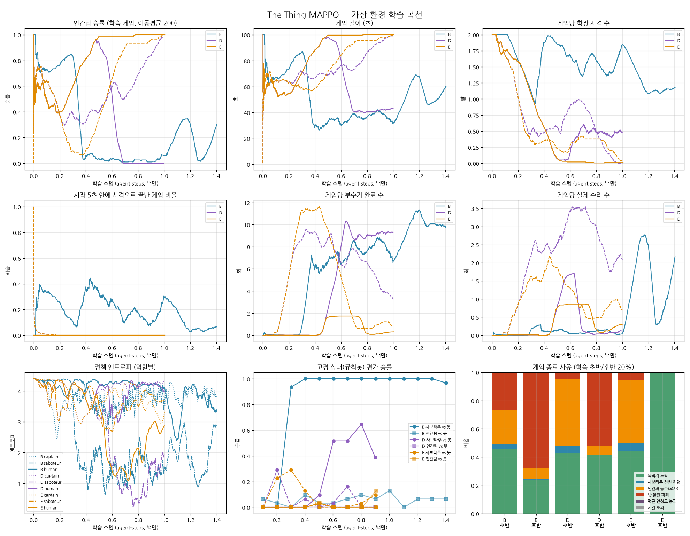

# 밸런스 조정 후 재실험 보고서

> **정정 (이후 발견된 버그)**: 이 실험 당시 규칙에서는 사보타주도 "수리"로 동료의 부수기를 끊을 수 있었다.
> 재생해 보니 D 시드1의 끊기는 인간 4.9회 + 사보타주 3.9회, E 시드0은 인간 1.4회 + 사보타주 0.03회였다.
> 인간팀이 끊기를 배운 것은 맞지만, D 시드1의 승리 일부는 사보타주끼리의 방해 덕분이다.
> 규칙 수정 후 재실험은 `../captain_rules/REPORT.md`.

이전 실험(`../REPORT.md`)에서 인간팀이 학습하지 못한 원인은 "방 하나에 붙어 부수기"가 규칙상 필승이었기 때문이었다.
그래서 밸런스를 조정하고 같은 시뮬레이터, 같은 트레이너(B 수정판)로 다시 학습시켰다.



## 바꾼 것 (`config/TheThing.yaml`, Unity C#에도 반영)

| 항목 | 이전 | 이후 |
|---|---|---|
| 위치 알림 임계값 `alert_threshold` | 30% | 70% |
| 부수는 중인 방에 수리 시작 `repair_interrupts_sabotage` | 사용 중이라 불가 | 부수기를 끊고 방을 차지 |
| 시작 직후 사격 `shoot_grace_time` | 즉시 가능 | 10초간 불가 |
| 방 하나 0% → 즉시 패배 `room_destroy_loss` | 유지 | 유지 (없애면 사보타주가 아예 못 이김) |

학습 없이 측정한 매치업(`tune_results.md`)으로 값을 정했다.
스크립트 "방 붙기" 사보타주 vs 규칙봇 인간팀의 사보타주 승률은 100% → 60%가 됐다.
규칙봇끼리는 사보타주가 38~43%를 이겨 거의 대등하다.

## 실험

| 이름 | 내용 | 시드 | 학습 스텝 |
|---|---|---|---|
| B | 이전 밸런스 (비교 기준, 이전 실험 그대로) | 0 | 1.4M |
| D | 새 밸런스 | 0, 1 | 1.0M |
| E | 새 밸런스 + 인간팀이 부수기를 끊으면 보상 +1 | 0, 1 | 1.0M |

## 결과

### 학습 후반(마지막 20%) 학습 게임

| 실행 | 인간팀 승률 | 부수기/게임 | 수리/게임 | 끊기/게임 | 사격/게임 |
|---|---|---|---|---|---|
| B (이전 밸런스) | 25% | 10.3 | 1.9 | 0 | 1.1 |
| D 시드0 | 0% | 9.3 | 0.1 | 0.1 | 0.5 |
| D 시드1 | 98% | 3.3 | 2.0 | **3.9** | 0.0 |
| E 시드0 | 100% | 0.4 | 0.4 | 1.3 | 0.0 |
| E 시드1 | 99% | 0.9 | 0.8 | 0.9 | 0.0 |

### 규칙봇 상대 평가 (마지막 평가)

| 실행 | 학습된 사보타주 vs 봇 인간팀 | 학습된 인간팀 vs 봇 사보타주 |
|---|---|---|
| B | 97% | 7% |
| D 시드0 | 39% | 0% |
| D 시드1 | 0% | 0% |
| E 시드0 | 10% | 13% |
| E 시드1 | 10% | 0% |

## 해석

1. **밸런스 조정으로 인간팀도 학습할 수 있게 됐다.**
   - 이전 밸런스에서는 인간팀이 한 번도 이기는 쪽이 되지 못했다.
   - 새 밸런스에서는 4개 실행 중 3개(D 시드1, E 시드0·1)에서 인간팀이 "알림이 뜬 방으로 가서 수리로 부수기를 끊는" 행동을 배웠다(D 시드1: 게임당 끊기 3.9회).
   - 학습 게임 승률은 98~100%까지 올라간다.
2. **그러나 결과가 한쪽 독식으로 수렴한다.**
   - 먼저 앞서간 팀이 상대를 무너뜨리고, 진 팀은 회복하지 못한다.
   - D 시드0: 인간팀이 0.5M까지 앞서다가 0.65M에 사보타주가 역전해 인간 승률 0%가 됐다.
   - E: 인간팀이 이긴 뒤 사보타주의 부수기 시도 자체가 거의 사라졌다(엔트로피 3.5~3.7로 다시 무작위에 가까워짐).
   - 시드에 따라 승자가 갈리고 1M 스텝 안에 균형점이 나오지 않는다.
3. **학습된 전략이 일반화되지 않는다.**
   - 학습 상대에게는 98~100% 이기는 인간팀이 규칙봇 사보타주에게는 0~13%다.
   - 봇 상대로는 끊기가 게임당 0.2회뿐이다(규칙봇 인간팀은 1.6회).
   - 같이 학습한 사보타주의 특정 행동에만 맞춰진 것으로 보인다. 학습된 사보타주 엔트로피가 2.0 안팎으로 낮아 행동이 단조로운 것과 일치한다.
   - 다만 사보타주가 어느 방을 골랐는지는 로그에 없어서 직접 확인하지는 못했다.
4. **E의 끊기 보상은 인간팀 쪽으로 기울게만 만들었다.**
   - 두 시드 모두 인간팀이 이겼지만, 봇 상대 성능은 D와 차이가 없다.
   - 보상 셰이핑보다 학습 상대의 다양성이 더 큰 문제다.
5. **함장이 사격을 완전히 포기했다** (게임당 0~0.5발, 명중 0%).
   - 시작 직후 사격을 막자 "아무나 쏴서 얻는 이득"이 사라졌다.
   - 목격 근거로 사보타주를 고르는 행동은 여전히 나타나지 않는다. 쏘면 오사 위험(-5)만 있고 근거(목격)는 드물다.

## 결론

- **밸런스 문제는 해결 방향이 맞다.** 인간팀이 실제로 대응 전략을 배울 수 있는 구조가 됐다.
- **이제 병목은 self-play의 불안정성이다.** 두 팀이 서로만 보고 학습하니 한쪽 독식으로 끝나고, 학습된 정책이 다른 상대에게 통하지 않는다.

## 다음 단계 제안

1. **상대 다양화**: 학습 게임의 일부(예: 30%)는 규칙봇 상대로 하거나, 과거 체크포인트 풀에서 상대를 뽑는다(PFSP 등).
   독식과 과적합을 직접 겨냥한다.
2. **팀별 학습 속도 조절**: 한쪽 승률이 일정 이상이면 그 팀 업데이트를 쉬는 식으로 균형을 유지한다.
3. **함장 사격 보상**: 사보타주 명중 시 함장에게 개별 보상(+2 등)을 줘서 "확신이 있을 때만 쏘기"를 배울 신호를 만든다.
4. **로그 보강**: 사보타주가 고른 방, 끊긴 위치를 기록해 과적합 가설을 직접 검증한다.

## 한계

- 시드 2개씩, 1M 스텝. 결과가 시드에 따라 크게 갈리므로 확정적인 결론은 아니다.
- 시뮬레이터 근사(직선 이동, 단순화한 규칙봇)는 이전 보고서와 같다.
- Unity C# 변경은 컴파일 확인을 하지 못했다.

## 재현

```bash
python sim/tune_balance.py 60 current v1_chosen
python sim/run_trainer.py --out runs/expD_s0 --seed 0 --timesteps 1000000
SIM_INTERRUPT_BONUS=1.0 python sim/run_trainer.py --out runs/expE_s0 --seed 0 --timesteps 1000000
python sim/analyze.py --run D=runs/expD_s0 --run E=runs/expE_s0 --out sim/results/balance
```
