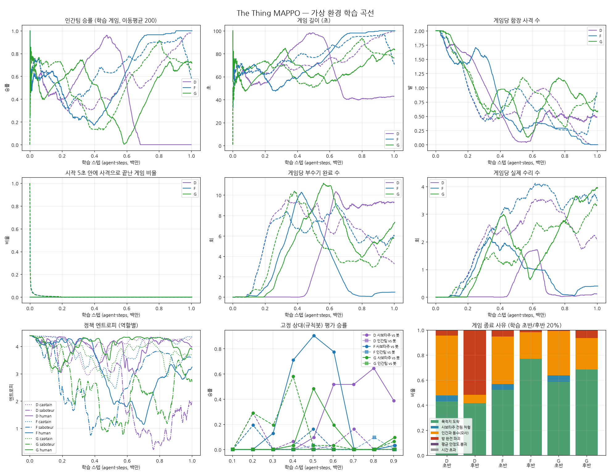

# 2차 밸런스 조정 보고서

1차 조정(`../balance/REPORT.md`, 이하 D)에서 인간팀이 배우기 시작했지만 두 가지 문제가 남았다.

- 실행마다 한 팀이 독식했다.
- 함장이 사격을 포기했다.

이번에는 D를 기준으로 함장에게 추리 근거를 주는 규칙을 더하고, 시야를 조정해 다시 학습시켰다.

## 바꾼 것

| 항목 | D (1차) | F | **G (채택)** |
|---|---|---|---|
| 알림 70%, 수리로 부수기 끊기, 사격 유예 10초 | ✓ | ✓ | ✓ |
| 목격 공유 `share_witness` (인간이 본 부수기를 함장에게 신고) | ✗ | ✓ | ✓ |
| 시야 `vision_range` | 10 | 10 | 12 |

학습 없이 측정한 격자 탐색 결과는 `grid_v2.jsonl`에 있다.

- 사보타주 승률: 알림 70% + 목격 공유에서 방 붙기 전략 40%, 규칙봇끼리 50%.
- 시야 12에서는 방 붙기 42%, 규칙봇끼리 40%.
- 규칙봇 함장의 사격은 게임당 0.04발(공유 없음) → 0.34~0.52발(공유)로 늘었고, 명중률은 100%였다.
- 알림 60%는 사보타주가 86~88%를 이겨 기각했다.
- 함선 정지 임계값은 결과에 영향이 없다(방이 먼저 0%가 된다).

## 결과 (학습 1M 스텝, 시드 2개씩)

### 학습 후반(마지막 20%)

| 실행 | 인간팀 승률 | 부수기/게임 | 수리/게임 | 끊기/게임 | 사격/게임 (명중) |
|---|---|---|---|---|---|
| D 시드0 | 0% | 9.3 | 0.1 | 0.1 | 0.5 (0%) |
| D 시드1 | 98% | 3.3 | 2.0 | 3.9 | 0.0 |
| F 시드0 | 100% | 0.5 | 0.4 | 1.2 | 0.0 |
| F 시드1 | 54% | 5.7 | 3.3 | 4.7 | 1.0 (0%) |
| **G 시드0** | **72%** | 7.2 | 3.9 | 5.1 | 0.6 (1%) |
| **G 시드1** | **65%** | 5.8 | 3.3 | 4.7 | 0.9 (0%) |

### 규칙봇 상대 평가 (마지막)

| 실행 | 학습된 사보타주 vs 봇 인간팀 | 학습된 인간팀 vs 봇 사보타주 |
|---|---|---|
| D 시드0 / 시드1 | 39% / 0% | 0% / 0% |
| F 시드0 / 시드1 | 3% / 3% | 0% / 0% |
| G 시드0 / 시드1 | 10% / 7% | 0% / 0% |

## 해석

1. **독식이 줄었다.**
   - D는 두 시드 모두 한쪽이 98~100% 이기는 쪽으로 끝났다.
   - G는 두 시드 모두 인간팀 65~72%에서 양쪽이 계속 싸운다. 사보타주는 게임당 6~7회 부수고, 인간팀은 5회 끊는다.
   - F는 한 시드(시드0)에서 사보타주가 붕괴했다.
   - 학습 상대끼리의 게임 균형은 G가 가장 좋다.
2. **함장은 여전히 아무것도 배우지 못했다.**
   - 학습된 체크포인트로 게임을 다시 돌려 사격을 하나하나 기록했다(`shots_*.txt`). F 시드1은 81발, G 시드0은 8발이었다.
   - **전부 인간을 쐈고, 사격 순간 함장 관측에 목격 플래그가 켜진 대상은 하나도 없었다.**
   - 사격 시각 중앙값은 11~16초(유예 직후), 대상은 시야 경계 근처에서 움직이던 인간이었다.
   - 함장 정책 엔트로피가 3.5~4.3(균등분포 4.39)으로 거의 무작위다. 행동 9개 중 6개가 "사격"이라, 시야에 누가 들어오면 확률적으로 쏜다.
   - 학습된 사보타주는 함장 근처에 오지 않으니 시야 안에는 늘 인간뿐이다.
   - 즉 함장 근처의 인간은 오사로 죽고, 이 오사가 사보타주 승리의 주된 경로("인간과 동수", 21~43%)가 된다.
   - 목격 공유로 플래그가 켜지더라도, 그 사보타주가 함장 시야(12) 안에 있어야 쏠 수 있다. 신고가 행동으로 이어질 길이 거의 없다.
3. **규칙봇 상대 일반화는 여전히 안 된다** (학습된 인간팀 vs 봇 0%).
   - 밸런스로 해결할 문제가 아니라, 같은 상대끼리만 학습하는 구조(self-play)의 문제로 보인다.

## 채택

G의 값을 `config/TheThing.yaml`, `TheThing_fast.yaml`, Unity C#에 반영했다.

- `share_witness: 1`, `vision_range: 12`
- `GameManager.shareWitness`, `CollectWitnesses`에서 함장 목격 기록 추가
- `NPCAIBrain`은 신고된 부수기를 직접 목격처럼 의심 점수에 반영
- 씬의 `visionRange` 12

## 다음 단계 제안

1. **함장 사격 규칙**: 함장 문제의 직접 원인을 겨냥한다.
   - (a) 원래 Unity 설계처럼 "소집 후 처형"으로 바꿔 신고된(목격 플래그) 대상은 거리와 무관하게 지목할 수 있게 한다.
   - 또는 (b) 사격 행동을 "목격 플래그가 켜진 대상만 쏠 수 있음"으로 제한(action mask)해 무작위 오사를 없앤다.
2. **학습 상대 다양화**: 학습 게임 일부를 규칙봇이나 과거 체크포인트 상대로 돌려 일반화를 노린다.
3. 함장 명중 시 개별 보상.

## 한계

- 시드 2개, 1M 스텝. 실행마다 곡선이 크게 흔들리므로 F와 G의 차이는 경향으로만 봐야 한다.
- Unity C# 변경은 컴파일하지 못했다.
