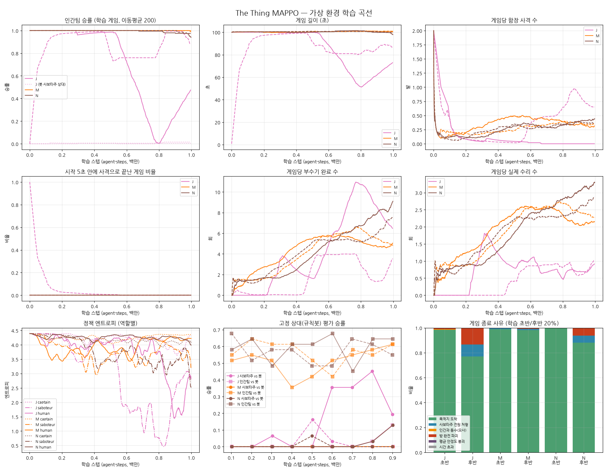

# 밸런스 조정만으로 인간팀 학습 개선 (커리큘럼 없이)

이전 실험(`../shaping_curriculum/REPORT.md`, 이하 J)에서는 보상 셰이핑이 있어야만 인간팀이 학습했다.
이번에는 커리큘럼 없이 **게임 규칙(밸런스)만으로** 인간팀이 학습할 수 있는지 확인했다.

## 인간팀이 학습하지 못한 원인 3가지 (추정)와 대응

| 원인 | 근거 | 대응한 밸런스 규칙 |
|---|---|---|
| 1. 결과가 인간팀 행동과 무관 (공짜 전승 → 무조건 전패) | H·L에서 초반 100% → 사보타주 학습 후 0% | 함선 속도 ∝ 평균 안정도: 수리 하나하나가 도착 시간에 반영됨 |
| 2. 대응 행동이 너무 길고 시간창이 짧음 | 셰이핑 없으면 목격·끊기 0회 | **이동 확정**(도착 전엔 새 방 선택 무시), **자동 수리**(손상된 방 근처에 가면 수리/끊기 자동), **분산 스폰**(카페 대신 방 근처에서 시작) |
| 3. 사보타주 전략이 쉬워 먼저 학습 → 인간팀 전패 고착 | 사보타주 0.2~0.4M에 방 붙기 학습 | 부수기 피해 10 → 7 (방 파괴까지 더 오래 걸림) |

## 규칙 선정 (학습 없이 측정, `../balance_v2/grid_v4*.jsonl`, `grid_v4c/d.jsonl`)

**새 목표 지표: "무작위 인간팀 vs 방 붙기 사보타주"의 인간 승률.**
학습 전 인간팀도 가끔 이겨야 승패에서 배울 신호가 생긴다.

| 조합 | 무작위 인간 vs 방 붙기 (인간 승) | 무작위 인간 vs 봇 사보 (인간 승) | 방 붙기 vs 봇 인간 (사보 승) | 봇 vs 봇 (사보 승) |
|---|---|---|---|---|
| 이전 (v3) | 0% | 0% | 38% | 42% |
| 속도∝안정도, 분산 스폰, 수리 거리, 반복 피해 감소, 피해 7의 모든 조합 | **0~3%** | — | — | — |
| + 자동 수리 | 0~3% | — | — | — |
| **+ 이동 확정 (채택: 자동 수리 + 분산 스폰 + 피해 7 + 속도∝안정도)** | **45%** | **35%** | 55% | 30% |

- 이동 확정 없이는 어떤 조합도 소용없었다.
- 0.4초마다 목적지를 다시 고르는 무작위 정책은 출발점 근처만 맴돌고, 방 붙기 중인 방에 끝내 도착하지 못한다.

## 학습 결과 (1M 스텝, 시드 2개씩, 커리큘럼 없음)

| 실행 | 셰이핑 | 학습 정책끼리 인간 승률 (후반) | **인간팀 vs 규칙봇 사보타주 (마지막 평가)** | 사보타주 vs 규칙봇 인간팀 | 수리/게임 | 부수기/게임 | 함장 사격/게임 (명중) |
|---|---|---|---|---|---|---|---|
| J 시드0 / 시드1 (이전) | ✓ | 98% / 75% | 13% / 0% | 19% / 0% | 1.6 / 1.2 | 2.2 / 5.1 | 0 / 0.54 |
| M 시드0 / 시드1 | ✓ | 99% / 100% | **61% / 61%** | 0% / 0% | 2.2 / 2.0 | 5.3 / 4.1 | 0.30 / 0.31 (100%) |
| N 시드0 / 시드1 | **✗** | 91% / 96% | **65% / 55%** | 13% / 0% | 3.2 / 3.1 | 9.5 / 8.6 | 0.42 / 0.32 (100%) |

참고: 새 밸런스에서 **무작위** 인간팀은 규칙봇 사보타주를 35% 이긴다.

## 해석

1. **밸런스만으로 인간팀 신호가 생겼다.**
   - 규칙봇 사보타주 상대로 학습된 인간팀이 55~65%를 이긴다.
   - 이전 밸런스에서는 학습해도 0~13%, 무작위는 0%였다.
   - 새 밸런스의 무작위 기준선(35%) 대비 20~30%p를 학습으로 더했다.
2. **셰이핑이 필요 없어졌다.**
   - 셰이핑 없는 N이 셰이핑 있는 M과 같거나 더 낫다(봇 상대 55~65% vs 61%).
   - 커리큘럼도, 셰이핑도 없이 규칙만으로 된다.
3. **함장 사격이 모든 실행에서 작동한다.**
   - 게임당 0.3~0.4발, 전부 근거 기반이라 명중 100%.
   - 이전에는 J 시드1 하나에서만 나왔다.
4. **하지만 이번엔 사보타주 쪽이 막혔다** (원인 3이 반대로 뒤집힘).
   - 학습 정책끼리 게임에서 인간팀이 처음부터 거의 100% 이긴다.
   - 사보타주는 규칙봇 인간팀 상대로 0~13%다.
   - 무작위 사보타주는 어떤 조합에서도 이기지 못했다(0%).
   - 다만 사보타주의 부수기 수는 학습 내내 꾸준히 늘었다(1.5 → 5~9회/게임). N은 마지막 10% 구간에서 인간 승률이 88~94%로 떨어지기 시작했다. 사보타주도 학습 중이지만, 1M 안에 이기는 단계까지 가지 못했다.
5. **인간 정책 엔트로피는 4.0~4.2로 높다.**
   - 자동 수리·이동 확정이 행동 선택 부담을 덜어 준 만큼, "어느 방으로 갈지" 외에는 정교한 행동이 필요 없어졌다.
   - 학습 효과의 일부는 규칙이 쉬워진 덕분이다.

## 반영 (yaml + Unity C#)

- `config/TheThing.yaml`, `TheThing_fast.yaml`
  - `commit_move 1`, `auto_repair 1`, `spawn_spread 1`, `ship_speed_by_health 1`, `sabotage_damage 7`
- `GameManager`: `commitMove`, `autoRepair`, `spawnSpread`, `shipSpeedByHealth` 필드와 env param 연동
  - 분산 스폰은 `NavMesh.SamplePosition`으로 보정
  - 함선 속도에 평균 안정도 반영
- `NPCAgent`: 방으로 이동 중이면 새 방 선택 무시
- `NPCController.TryAutoRepair`: 인간팀 ML 에이전트가 손상된 방 근처(`interactionRange`)에 있으면 자동 수리. 사보타주가 부수는 중이면 끊음.
- 씬의 `sabotageDamage` 7
- 셰이핑 값은 yaml에 남겨 뒀다. 끄려면 `reward_*`를 0으로.

## 다음 단계 제안

1. **사보타주 쪽을 약간 강화**:
   - 격자 탐색(`grid_v4d.jsonl`)에서 `auto_sabotage 1` + `total_distance 1300`(도착 130초)이 가장 그럴듯했다.
   - 이 조합은 방 붙기 vs 봇 인간 68%, 무작위 인간 vs 방 붙기 38%, 무작위 인간 vs 봇 38%로, 인간팀 신호를 유지하면서 사보타주를 강하게 만든다.
   - `auto_sabotage`는 시뮬레이터에만 있다. 채택하면 Unity로 옮겨야 한다.
2. **더 길게(2M+) 학습**: N에서 사보타주가 따라잡기 시작한 추세가 이어지는지 확인한다.

## 한계

- 시드 2개, 1M 스텝. 시뮬레이터 근사(직선 이동, 단순화한 규칙봇)는 이전과 같다.
- Unity C# 변경은 컴파일 확인을 하지 못했다.
  - `NPCController.TryAutoRepair`는 매 프레임 방 8개를 훑는다(비용은 작음).
  - 분산 스폰 위치는 NavMesh 위로 보정하지만, 실제 맵에서 방 근처가 걸을 수 있는 곳인지는 에디터에서 확인이 필요하다.
