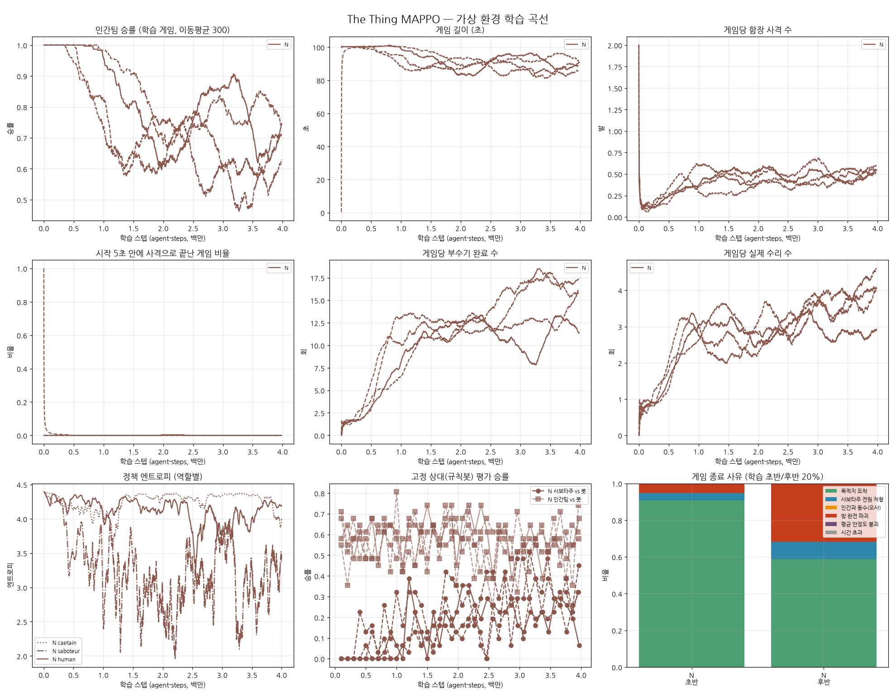

# 새 밸런스(N) 4M 스텝 학습 보고서 — 시드 4개

`../balance_v4_long/REPORT.md`(2M)를 4M으로 늘렸다.

- 설정은 같다: 새 밸런스, 셰이핑 없음, 커리큘럼 없음.
- 2M 체크포인트(네트워크·옵티마이저·스텝 수 포함)에서 이어 학습했다. 하나의 4M 학습과 같다.
- 앞 2M과 뒤 2M 기록은 `sim/merge_runs.py`로 이어 붙였다.

## 결과

### 학습 정책끼리 게임: 0.5M 구간별 인간팀 승률

| 시드 | 0~0.5M | 0.5~1M | 1~1.5M | 1.5~2M | 2~2.5M | 2.5~3M | 3~3.5M | 3.5~4M |
|---|---|---|---|---|---|---|---|---|
| 0 | 100% | 94% | 82% | 60% | 75% | 87% | 75% | 69% |
| 1 | 100% | 98% | 89% | 69% | 73% | 81% | 76% | 76% |
| 2 | 95% | 78% | 62% | 76% | 61% | 60% | 59% | 62% |
| 3 | 97% | 70% | 65% | 64% | 76% | 62% | 50% | 71% |

### 학습 정책끼리 게임: 게임당 행동 (1.5~2M → 3.5~4M)

| 시드 | 부수기 | 수리 | 끊기 | 함장 사격 |
|---|---|---|---|---|
| 0 | 12.7 → 12.0 | 2.5 → 2.9 | 0.8 → 0.4 | 0.53 → 0.51 |
| 1 | 12.1 → 15.3 | 2.8 → 4.4 | 0.6 → 0.8 | 0.49 → 0.57 |
| 2 | 11.9 → 17.0 | 3.3 → 4.0 | 1.3 → 1.2 | 0.41 → 0.54 |
| 3 | 11.9 → 15.7 | 2.3 → 4.0 | 0.5 → 1.3 | 0.39 → 0.51 |

### 규칙봇 상대 평가 (학습 구간 4분위 평균: 0~1M / 1~2M / 2~3M / 3~4M)

| 시드 | 학습된 사보타주 vs 봇 인간팀 | 학습된 인간팀 vs 봇 사보타주 |
|---|---|---|
| 0 | 2% / 16% / 26% / 20% | 60% / 61% / 59% / 55% |
| 1 | 1% / 13% / 17% / 24% | 56% / 62% / 56% / 55% |
| 2 | 12% / 27% / 34% / 35% | 58% / 56% / 55% / 56% |
| 3 | 3% / 11% / 18% / 32% | 58% / 53% / 51% / 55% |
| **평균** | **5% / 17% / 24% / 28%** | **58% / 58% / 55% / 55%** |

기준선: 무작위 인간팀 vs 봇 사보타주 35%, 무작위 사보타주 vs 봇 인간팀 0%.

### 정책 엔트로피 (같은 4분위 평균, 균등분포 4.39)

| 시드 | 인간 | 사보타주 | 함장 |
|---|---|---|---|
| 0 | 4.24 → 4.18 → 4.02 → 4.07 | 3.68 → 3.04 → 3.05 → 3.09 | 4.2~4.3 |
| 1 | 4.19 → 4.20 → 4.06 → 3.79 | 3.78 → 3.12 → 3.03 → 2.76 | 4.3 |
| 2 | 4.19 → 3.91 → 4.00 → 4.10 | 3.17 → 2.94 → 2.52 → 2.45 | 4.3 |
| 3 | 4.15 → 4.11 → 3.95 → 4.09 | 3.26 → 3.14 → 2.81 → 2.39 | 4.3 |

## 해석: 2M → 4M에서 무엇이 좋아졌나

1. **좋아진 점: 사보타주가 계속 강해졌다.**
   - 규칙봇 인간팀 상대 승률이 평균 17%(1~2M)에서 28%(3~4M)로 올랐다.
   - 게임당 부수기는 12회에서 15~17회로 늘었다(시드 1~3).
   - 사보타주 엔트로피가 계속 내려가는 것으로 보아 전략이 다듬어지고 있다.
2. **좋아진 점: 인간팀이 학습 상대인 사보타주에 맞춰 대응을 늘렸다.**
   - 사보타주가 더 많이 부수는데도 학습 정책끼리 인간 승률은 1.5~2M의 60~76%에서 3.5~4M의 62~76%로 유지됐다.
   - 그동안 게임당 수리가 2.3~3.3회에서 2.9~4.4회로, 끊기도 시드 1·3에서 늘었다.
   - 두 팀이 서로 맞대응하며 승률이 50~90% 사이를 오르내린다. 한쪽으로 붕괴하지 않는 공진화 상태가 4M까지 유지됐다.
3. **나아지지 않은 점: 인간팀의 일반화.**
   - 규칙봇 사보타주 상대 승률은 58%에서 55%로 오히려 소폭 떨어졌다(무작위 35%).
   - 인간 정책 엔트로피도 4.0~4.1에 머문다(시드 1만 3.8).
   - 인간팀은 학습 상대에게 맞춘 대응(수리·끊기 증가)은 늘었지만, 다른 방식으로 부수는 규칙봇에게 통하는 일반적인 전략으로는 발전하지 않았다.
4. **함장은 정책으로 배우는 것이 거의 없다.**
   - 엔트로피가 4.3으로 거의 무작위다.
   - 사격(게임당 약 0.5발, 명중 100%)은 근거 규칙 덕분에 무작위 정책으로도 일어난다.

## 결론

- 4M까지 늘려도 학습은 안정적이다. 붕괴나 독식이 없고, 사보타주 쪽은 계속 좋아진다.
- 인간팀은 2M 이후 실질적인 향상이 없다. 학습을 더 늘리는 것만으로는 인간팀 성능이 더 오르지 않을 것으로 보인다.

## 다음 단계 제안 (복잡도를 늘리지 않는 순서)

1. **인간팀 보상 신호 보강 (최소한으로)**
   - 지금 인간팀이 받는 과정 보상은 평균 안정도 변화(부수기 1회당 약 0.009)와 수리 보상뿐이다. 승패 외 신호가 약하다.
   - 이전 밸런스에서 효과가 확인된 셰이핑 중 `reward_interrupt`(끊기)만 다시 켜는 정도가 가장 단순하다.
2. **엔트로피 계수 조정**
   - 인간·함장 정책이 4M 동안 거의 무작위다. `entropy_coef 0.01`이 이 행동 공간(9×9)에서는 큰 편일 수 있다.
   - 0.003 정도로 낮춰 비교할 만하다. 트레이너 설정 하나만 바꾸면 된다.

## 한계

- 시뮬레이터 근사(직선 이동, 단순화한 규칙봇)는 이전과 같다.
- 평가 구간은 평가 블록 순서로 4등분한 근사다.
