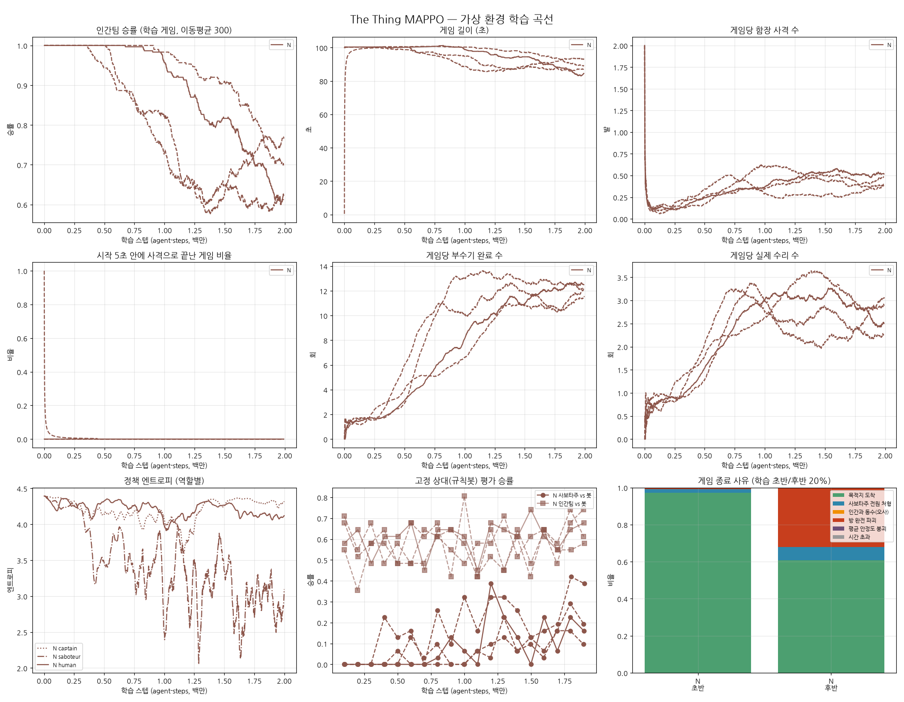

# 새 밸런스(N) 장기 학습 보고서 — 2M 스텝, 시드 4개

`../balance_v4/REPORT.md`의 N 설정을 그대로 두고 학습만 늘렸다.

- 새 밸런스: 이동 확정, 자동 수리, 분산 스폰, 함선 속도 ∝ 평균 안정도, 부수기 피해 7
- 보상 셰이핑 없음, 커리큘럼 없음
- 학습 1M → 2M 스텝, 시드 2개 → 4개

(엔트로피 패널은 시드 0만, 나머지 패널은 실선이 시드 0이고 점선이 시드 1~3이다.)

## 결과

### 학습 정책끼리 게임: 10구간별 인간팀 승률

| 시드 | 0~10% | 20~30% | 40~50% | 60~70% | 80~90% | 90~100% |
|---|---|---|---|---|---|---|
| 0 | 100% | 100% | 89% | 75% | 63% | 62% |
| 1 | 100% | 100% | 96% | 91% | 74% | 67% |
| 2 | 100% | 83% | 79% | 66% | 83% | 72% |
| 3 | 100% | 81% | 59% | 55% | 49% | 74% |

같은 구간의 게임당 부수기 수는 네 시드 모두 1.5~1.8회에서 시작해 11~13회까지 늘었다.

### 학습 후반 20%

| 시드 | 인간 승률 | 부수기/게임 | 수리/게임 | 끊기/게임 | 함장 사격/게임 (명중) | 종료 사유 |
|---|---|---|---|---|---|---|
| 0 | 62% | 12.5 | 2.5 | 0.7 | 0.51 (100%) | 도착 51%, 방 파괴 38%, 전원 처형 12% |
| 1 | 71% | 12.0 | 2.9 | 0.6 | 0.49 (100%) | 도착 64%, 방 파괴 29%, 전원 처형 7% |
| 2 | 77% | 11.5 | 3.1 | 1.4 | 0.39 (100%) | 도착 71%, 방 파괴 23%, 전원 처형 7% |
| 3 | 61% | 12.1 | 2.3 | 0.5 | 0.39 (100%) | 도착 58%, 방 파괴 39%, 전원 처형 3% |

### 규칙봇 상대 평가 (처음 3회 평균 → 마지막 3회 평균)

| | 시드 0 | 시드 1 | 시드 2 | 시드 3 | 평균 |
|---|---|---|---|---|---|
| 학습된 사보타주 vs 봇 인간팀 | 0% → 15% | 0% → 22% | 0% → 33% | 0% → 14% | **0% → 21%** |
| 학습된 인간팀 vs 봇 사보타주 | 57% → 62% | 59% → 65% | 49% → 56% | 64% → 63% | **58% → 62%** |

참고 기준선: 새 밸런스에서 무작위 인간팀 vs 봇 사보타주 = 35%, 무작위 사보타주 vs 봇 인간팀 = 0%.

## 해석

1. **두 팀이 모두 학습하는 경쟁 상태가 처음으로 재현성 있게 나왔다.**
   - 네 시드 모두 같은 방향이다.
   - 이전 실험들(D~L)처럼 한쪽 독식으로 붕괴하거나 크게 출렁이지 않는다.
   - 인간 승률이 100%에서 시작해 사보타주가 학습하면서 60~77%로 내려와 머문다.
   - 게임 결과도 도착, 방 파괴, 처형 세 가지로 고르게 나뉜다.
2. **1M에서 보였던 "사보타주가 따라잡는 추세"는 진짜였다.**
   - 사보타주는 1M 무렵부터 꾸준히 강해졌다. 게임당 부수기가 약 10회에서 12회로 늘었고, 규칙봇 인간팀 상대 승률은 0%에서 평균 21%(최대 42%)가 됐다.
   - 1M 실험에서 사보타주가 막힌 것처럼 보였던 것은 학습이 덜 된 탓이었다.
3. **함장 규칙이 모든 시드에서 작동한다.**
   - 게임당 0.4~0.5발, 근거 기반이라 명중 100%다.
   - "사보타주 전원 처형" 승리가 3~12%다.
4. **인간팀의 추가 학습은 작다.**
   - 봇 상대 승률은 학습 초기에 이미 약 58%(무작위 35%)에 도달했고, 그 뒤로는 62%까지 소폭 올랐다.
   - 인간 정책 엔트로피도 4.1~4.2(균등 4.39)로 높게 유지된다(시드 2만 3.3).
   - 대응의 상당 부분을 규칙(자동 수리, 이동 확정)이 맡고 있어서, 정책이 배울 것은 "어느 방으로 갈지" 정도다.
   - 사보타주가 강해지는 동안 인간팀이 봇 상대 성능을 유지하거나 조금 올린 것 자체는 좋은 신호다.
5. **아직 완전한 균형점은 아니다.**
   - 시드 0과 1은 끝까지 인간 승률이 내려가는 중이다.
   - 시드 2와 3은 60~75% 사이에서 오르내린다.

## 결론

커리큘럼과 셰이핑 없이 밸런스 조정만으로 두 팀이 서로 맞서며 학습하는 상태를 얻었다. 결과는 시드 4개에서 재현됐다.
현재 yaml과 Unity에 반영된 설정이 이 실험의 설정이다. yaml의 셰이핑 값(`reward_*`)도 이 실험과 같이 0으로 바꿨다.

## 다음 단계 제안 (선택)

1. **3~4M 스텝**: 시드 0·1의 하락이 어디서 멈추는지, 균형점이 몇 %인지 확인.
2. **인간팀 전략 깊이**: 인간 엔트로피가 높은 것이 규칙이 쉬워서인지 확인하려면, 자동 수리를 끈 상태에서 이 체크포인트를 이어 학습해 볼 수 있다. 복잡도를 늘리지 않는 범위에서만 권한다.

## 한계

- 시뮬레이터 근사(직선 이동, 단순화한 규칙봇)는 이전과 같다. Unity 빌드에서 같은 결과가 나오는지는 실제 학습으로 확인해야 한다.
- Unity C# 변경은 컴파일 확인을 하지 못했다.
