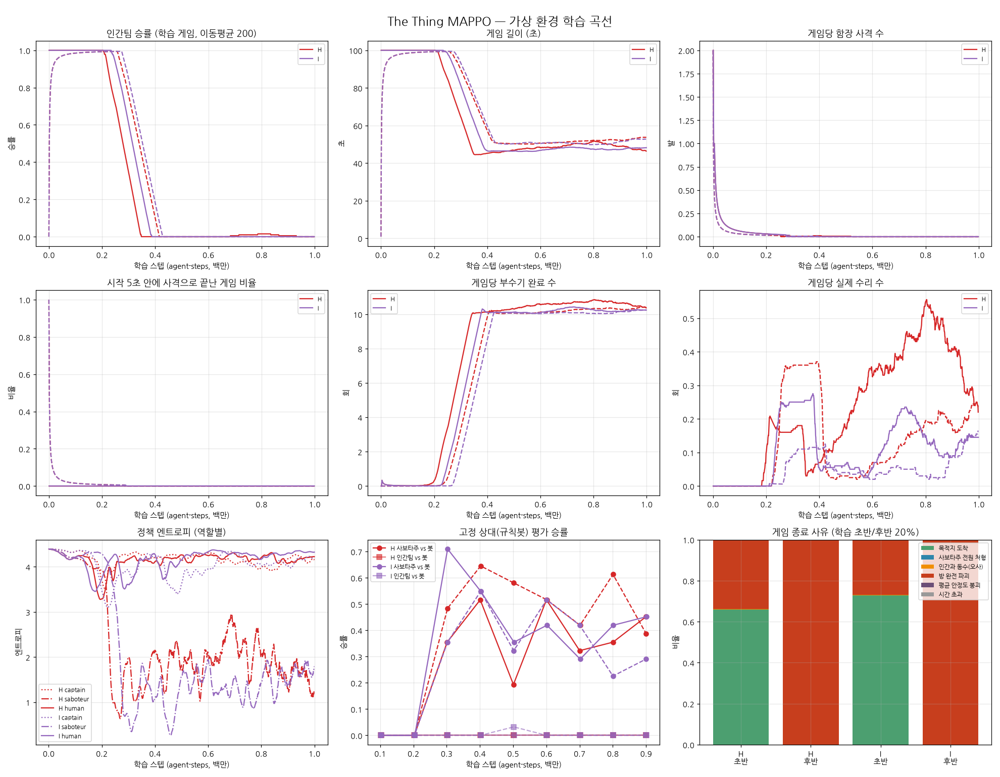

# 함장 사격 규칙 수정 보고서

2차 조정(`../balance_v2/REPORT.md`)에서 학습된 함장은 거의 무작위로 행동했다.
시야에 들어온 인간을 근거 없이 쏴서, 그 오사가 사보타주 승리의 주된 경로가 됐다.
이번에는 함장 역할은 유지하고 사격 방식과 규칙을 바꿨다.

## 바꾼 규칙 (시뮬레이터 + Unity C#)

| 규칙 | 이전 | 이후 |
|---|---|---|
| 사격 근거 `shoot_requires_evidence` | 없음 (시야 안 아무나) | 직접 목격했거나 신고받은(목격 공유) 대상만. 근거 없는 사격은 아무 일도 일어나지 않음 |
| 사거리 `shoot_range` | 시야(12) | 설정 가능: -1 = 시야, 0 = 무제한(원래 "소집 후 처형"), >0 = 거리 |
| 총알 `captain_bullets` | 2 (Inspector만) | 환경 파라미터로 조정 가능 |

- Unity에서는 `GameManager.CanShootTarget`이 유예 시간, 근거, 사거리를 한 곳에서 판정한다.
- `NPCAgent`(ML 함장)와 `NPCAIBrain`(규칙봇 함장)이 이 함수를 쓴다.
- 사람이 조작하는 플레이어 함장은 기존 방식 그대로다.

### 함께 고친 버그: 사보타주끼리 부수기를 끊을 수 있었음

이전 규칙에서는 **누구든** 수리를 시작하면 부수기가 끊겼다. 그래서 사보타주가 동료의 부수기를 끊을 수 있었다.
첫 실험(H, I)에서 "끊기는 게임당 1~7회인데 목격은 0회"라는 모순이 나와 체크포인트를 재생해 확인했다.

| 실행 | 인간이 끊음 | 사보타주가 끊음 |
|---|---|---|
| D 시드1 | 4.9 | 3.9 |
| E 시드0 | 1.4 | 0.03 |
| G 시드0 | 0 | 3.7 |
| I(수정 전) 시드0 | 0 | 6.6 |

- G·I에서 인간팀이 이긴 것은 사보타주끼리 서로 방해한 결과였다. 2차 보고서의 해석은 틀렸다(해당 보고서에 정정 문구 추가).
- 인간팀(선원·함장)만 끊을 수 있게 고쳤다.
- 규칙봇·스크립트 기반 밸런스 측정은 영향이 없었다. 규칙봇 사보타주는 수리를 하지 않으므로, 수정 전후 격자 결과가 완전히 같았다.

## 규칙 비교 (학습 없음, `../balance_v2/grid_v3.jsonl`)

| 규칙 | 방 붙기 vs 봇 인간 | 봇 vs 봇 | 무작위 vs 무작위 (오사로 인한 사보 승) |
|---|---|---|---|
| 근거 없음, 시야, 총알 2 (2차 G) | 42% | 40% | 34% (명중 38%) |
| **근거 + 사거리 25 + 총알 2 (I, 채택)** | 38% | 42% | **0%** (명중 100%) |
| 근거 + 무제한 + 총알 1 (H) | 68% | 46% | 0% |

근거 규칙으로 무작위 함장의 오사가 사라진다.

## 학습 결과 (버그 수정 후, 시드 2개씩 1M 스텝)

| 실행 | 인간팀 승률(후반) | 부수기/게임 | 끊기/게임 | 인간 목격/게임 | 함장 사격/게임 |
|---|---|---|---|---|---|
| H 시드0 / 시드1 | 0% / 0% | 10.5 / 10.4 | 0 / 0 | 0 / 0 | 0 / 0 |
| I 시드0 / 시드1 | 0% / 0% | 10.2 / 10.2 | 0 / 0 | 0 / 0 | 0 / 0 |

- 규칙봇 인간팀 상대로 학습된 사보타주는 30~45%를 이긴다. 학습된 인간팀은 규칙봇 사보타주를 0% 이긴다.
- 인간과 함장 정책 엔트로피는 4.1~4.3(균등분포 4.39)이다.

## 해석

1. **사격 규칙은 의도대로 작동한다.** 근거 없는 사격이 불가능해 오사가 0이 됐다.
2. **하지만 함장이 쏠 근거가 생기지 않는다.**
   - 인간이 부수기 현장 시야 안에 들어간 적이 한 번도 없다(목격 0).
   - 그러니 신고도, 함장 플래그도, 사격도 없다.
3. **실제 병목은 인간팀 학습이다.** 곡선의 흐름은 네 실행 모두 같다.
   - 0~0.2M: 사보타주가 아직 무작위라 아무것도 못 한다. 인간팀이 노력 없이 100% 이긴다.
   - 0.2~0.4M: 사보타주가 "가까운 방 하나 붙기"를 배워 인간팀 승률이 0%로 떨어진다.
   - 그 뒤: 인간팀은 매번 진다(-5).
   - 결국 인간팀은 "그냥 이기는" 구간과 "그냥 지는" 구간만 겪는다. 행동에 따라 결과가 달라지는 경험이 없으니 배울 신호가 없다.
   - 이길 수 있는 전략(알림이 뜬 방으로 가서 수리로 끊기)은 존재한다. 규칙봇 인간팀은 방 붙기 사보타주를 62% 이긴다.
   - 그러나 그 전략은 "8개 방 중 알림 방을 20초 이상 일관되게 고르고, 도착해서 수리 선택"이라는 긴 행동열이다. 무작위 탐색으로는 찾기 어렵다.
4. 이전 실험 중 인간팀이 실제로 끊기를 배운 경우는 E 시드0뿐이다. 유일하게 **끊기 보상(+1)** 이 있던 실험이다.

## 채택값

`config/TheThing.yaml`, `TheThing_fast.yaml`, `GameManager` 기본값에 반영했다.

- `shoot_requires_evidence: 1`
- `shoot_range: 25`
- `captain_bullets: 2`

## 다음 단계 제안 (인간팀 학습이 우선)

1. **인간팀 보상 셰이핑**
   - 알림이 뜬 방에 가까워지면 소량 보상, 부수기를 끊으면 보상(E에서 효과 확인), 목격하면 보상.
   - 목표는 승패 외에도 "대응 행동"에 직접 신호를 주는 것이다.
2. **커리큘럼/상대 다양화**
   - 학습 초반에 인간팀을 규칙봇 사보타주 상대로 먼저 학습시킨다(이길 수도 질 수도 있는 상대).
   - 또는 학습 게임 일부를 규칙봇 상대로 섞는다.
3. 위가 되면 함장 규칙의 효과(신고 → 사격)를 다시 측정한다.

## 한계

- 시드 2개, 1M 스텝. 시뮬레이터 근사(직선 이동, 단순화한 규칙봇)는 이전과 같다.
- Unity C# 변경은 컴파일 확인을 하지 못했다.
