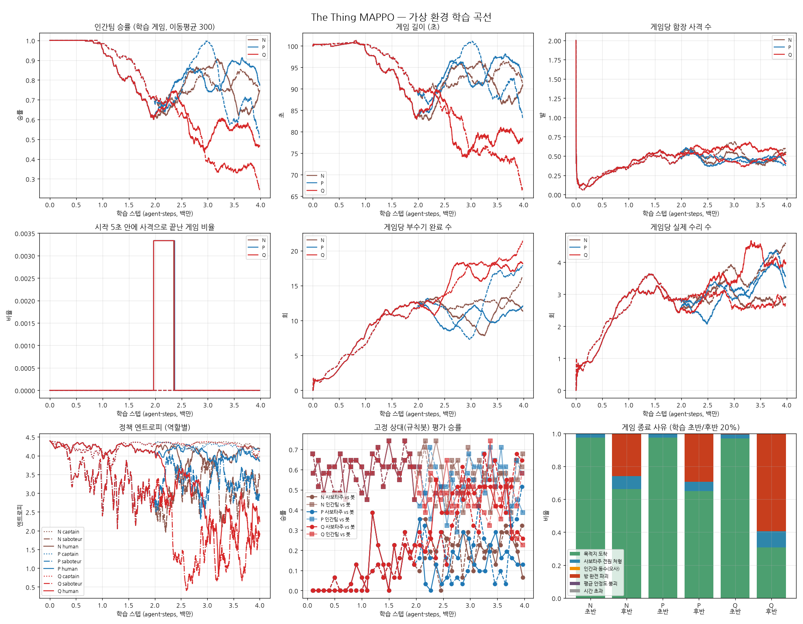

# 끊기 보상 vs 엔트로피 계수 비교

4M 실험(`../balance_v4_4m/REPORT.md`)에서 인간팀이 2M 이후 더 나아지지 않았다. 원인 후보 두 가지를 따로 시험했다.

| 실험 | 바꾼 것 | 나머지 |
|---|---|---|
| N (기준) | 없음 | 새 밸런스, 셰이핑 없음, `entropy_coef 0.01` |
| **P** | `reward_interrupt = 1` (수리로 부수기를 끊으면 +1) | N과 같음 |
| **Q** | `entropy_coef 0.01 → 0.003` (모든 역할) | N과 같음 |

- 세 실험 모두 같은 2M 체크포인트(시드 0, 1)에서 이어 4M까지 학습했다.
- 그래서 0~2M 구간은 셋이 같고, 차이는 2~4M에서만 난다.

## 결과 (3~4M 구간)

| 실험 / 시드 | 학습 정책끼리 인간 승률 | 부수기/게임 | 수리/게임 | 끊기/게임 | 목격/게임 | 함장 사격/게임 |
|---|---|---|---|---|---|---|
| N 시드0 / 시드1 | 73% / 76% | 11.4 / 14.1 | 2.8 / 4.0 | 0.57 / 0.65 | 1.0 / 1.3 | 0.45 / 0.49 |
| P 시드0 / 시드1 | 84% / 59% | 11.1 / 16.8 | 3.4 / 3.7 | 0.51 / 0.88 | 1.1 / 1.1 | 0.44 / 0.43 |
| Q 시드0 / 시드1 | 55% / 32% | 17.5 / 19.3 | 4.2 / 2.7 | **1.88 / 1.28** | 1.8 / 1.1 | 0.55 / 0.47 |

### 규칙봇 상대 평가 (3~4M, 시드당 평가 게임 약 170판씩)

| 실험 / 시드 | 학습된 사보타주 vs 봇 인간팀 | **학습된 인간팀 vs 봇 사보타주** |
|---|---|---|
| N | 20% / 24% | **55% / 57%** |
| P | 16% / 25% | **54% / 57%** |
| Q | **42% / 52%** | **43% / 46%** |

### 정책 엔트로피 (3~4M 평균, 균등분포 4.39)

| 실험 | 인간 | 사보타주 | 함장 |
|---|---|---|---|
| N | 4.06 / 3.79 | 3.11 / 2.76 | 4.28 / 4.27 |
| P | 3.96 / 3.96 | 3.34 / 2.49 | 4.23 / 4.16 |
| Q | **2.16 / 2.73** | **1.53 / 1.34** | 4.26 / 4.03 |

## 해석

1. **P(끊기 보상): 효과 없음.**
   - 인간팀의 봇 상대 승률(54~57%), 끊기 수, 엔트로피가 모두 N과 같은 수준이다.
   - 이 밸런스에서는 자동 수리가 끊기를 대신 해 주므로, 끊기 보상은 이미 일어나는 일에 점수를 더 줄 뿐 새 행동을 끌어내지 못한다.
   - 이전 밸런스(자동 수리 없음)에서는 끊기 보상이 결정적이었던 것과 대비된다.
2. **Q(엔트로피 0.003): 정책은 확실히 단단해졌지만 이득은 사보타주 쪽이 가져갔다.**
   - 인간 엔트로피 4.0 → 2.2~2.7, 사보타주 3.0 → 1.3~1.5로 두 팀 모두 행동이 결정적으로 바뀌었다.
   - 인간팀은 끊기(0.6 → 1.3~1.9회)와 목격이 늘었다. 무작위로 흩어지는 대신 의도적으로 대응하게 됐다.
   - 하지만 사보타주가 훨씬 더 강해졌다(부수기 17~19회, 봇 상대 20% → 42~52%). 학습 정책끼리 인간 승률은 55% / 32%로 떨어졌다.
   - **인간팀의 봇 상대 승률도 55% → 45%로 떨어졌다.** 상대와 무관한 지표라서, 인간팀이 학습 상대(사보타주)에 더 특화되고 일반성은 잃은 것으로 보인다.
   - 함장 엔트로피는 Q에서도 4.0~4.3이다. 함장은 정책으로 배우는 것이 여전히 거의 없다.
3. **결론적으로 둘 다 인간팀 일반 성능을 올리지 못했다.**
   - P는 아무 변화가 없었다.
   - Q는 "더 단단한 정책"을 만들었지만, 그 혜택은 전략 구조가 단순한 사보타주에게 더 크게 돌아갔다.

## 권장

- **기본 설정은 그대로 둔다** (`entropy_coef 0.01`, 셰이핑 없음). yaml과 트레이너 기본값은 바꾸지 않았다.
- 인간팀 쪽을 더 다듬고 싶다면 다음 후보가 남는다(둘 다 설정 한두 줄).
  - **역할별 엔트로피 계수**: 인간 0.003, 사보타주·함장 0.01. Q에서 인간 정책이 단단해지는 효과는 확인됐다. 사보타주만 함께 강해지는 부작용을 분리할 수 있다.
  - **평가 기준 재검토**: 규칙봇 사보타주는 학습 상대와 행동이 꽤 다르다(부수기 17~18회, 목격되면 회피). 지금 "인간팀 vs 봇" 지표는 일반화를 엄격하게 재는 대신 노이즈가 크다. 인간팀 성능은 과거 체크포인트 사보타주들을 상대로 재는 편이 학습 진행을 더 잘 보여 줄 수 있다.

## 한계

- 실험당 시드 2개. P의 시드 간 차이(84% / 59%)처럼 학습 정책끼리 승률은 시드에 따라 크게 흔들린다.
- 시뮬레이터 근사(직선 이동, 단순화한 규칙봇)는 이전과 같다.
