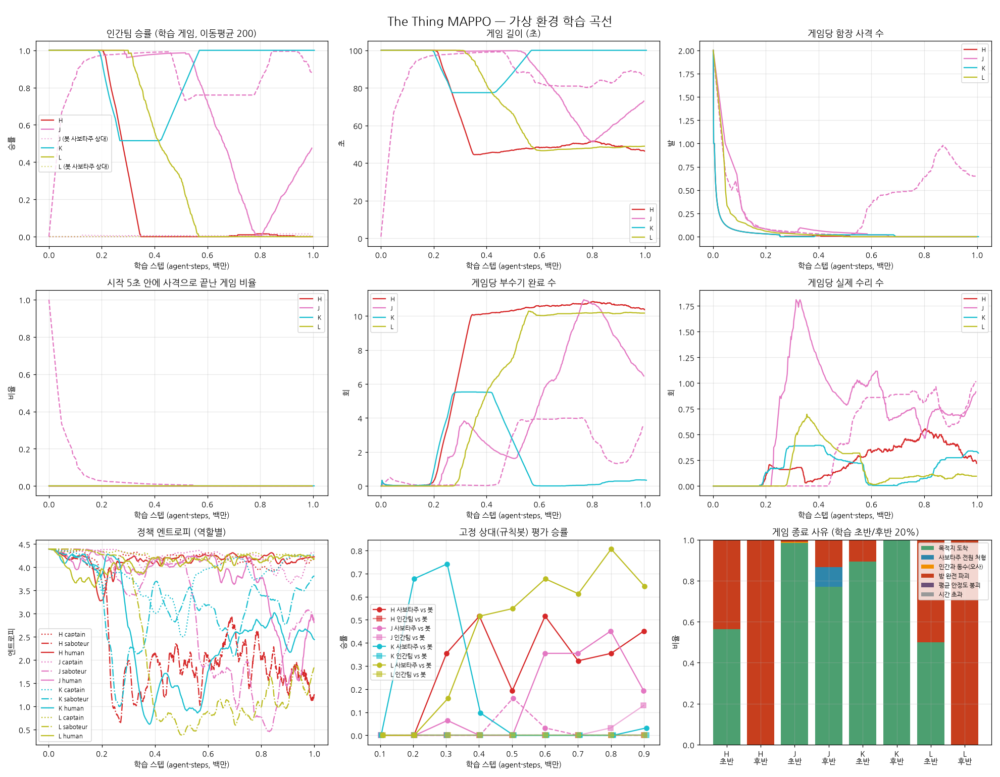

# 인간팀 보상 셰이핑 + 커리큘럼 보고서

함장 사격 규칙 수정 후(`../captain_rules/REPORT.md`, 이하 H) 인간팀이 전혀 학습하지 못했다.
사보타주가 "방 하나 붙기"를 배우는 순간 인간팀은 매번 지고, 행동에 따라 결과가 달라지는 경험이 없었다.
그래서 두 가지를 넣었다.

## 추가한 것 (시뮬레이터 + 트레이너 + Unity C#)

**1. 인간팀 보상 셰이핑** (환경 파라미터, 기본 0)

| 파라미터 | 값 | 의미 |
|---|---|---|
| `reward_alert_approach` | 0.01 | 가장 가까운 알림 방까지 거리가 1 줄 때마다 (잠재 기반) |
| `reward_interrupt` | 1.0 | 수리로 부수기를 끊음 |
| `reward_witness` | 0.3 | 사보타주를 처음 목격 (사보타주당 1회) |
| `reward_captain_hit` | 2.0 | 함장이 사보타주 명중 |

**2. 커리큘럼 / 상대 다양화** (트레이너 `bot_curriculum`, 환경 파라미터 `bot_team`)

- 학습 게임 일부에서 사보타주 팀을 규칙봇으로 둔다.
- 비율은 100%에서 시작해 50만 스텝 동안 30%까지 줄이고, 그 뒤로는 30%를 유지한다.
- Unity가 게임마다 `train/bot_team`을 보고하고, 트레이너는 규칙봇이 조종한 쪽의 데이터를 버린다.

## 실험 (학습 1M 스텝)

| 이름 | 셰이핑 | 커리큘럼 | 시드 |
|---|---|---|---|
| H (기준, 이전 실험) | ✗ | ✗ | 0 |
| **J** | ✓ | ✓ | 0, 1 |
| K | ✓ | ✗ | 0 |
| L | ✗ | ✓ | 0 |

## 결과

### 학습 정책끼리 게임 (후반 20%)

| 실행 | 인간팀 승률 | 인간 목격/게임 | 끊기/게임 | 부수기/게임 | 함장 사격/게임 (명중) | 인간 엔트로피 |
|---|---|---|---|---|---|---|
| H | 0% | 0 | 0 | 10.5 | 0 | 4.22 |
| **J 시드0** | 98% | 3.9 | 5.1 | 2.2 | 0 | 2.81 |
| **J 시드1** | 75% | 1.3 | 0.3 | 5.1 | **0.54 (100%)** | 3.96 |
| K | 100% | 2.7 | 1.4 | 0.4 | 0 | 2.44 |
| L | 0% | 0 | 0 | 10.2 | 0 | 4.18 |

종료 사유를 보면 J 시드1은 "사보타주 전원 처형"이 19%다. 함장이 근거로 사보타주를 처형해 이긴 게임이 처음 나왔다.

### 규칙봇 사보타주 상대

| 실행 | 학습 중 봇 게임 인간 승률 (초반 → 후반) | 평가: 인간팀 vs 봇 (마지막) |
|---|---|---|
| J 시드0 | 0% → 3% | 13% |
| J 시드1 | 0% → 0% | 0% |
| L | 0% → 0% | 0% |

규칙봇 사보타주는 게임당 17~18회를 부순다(학습된 사보타주 약 10회). 그리고 목격되면 피한다.

## 해석

1. **셰이핑이 결정적이었다.**
   - 셰이핑이 있는 J·K에서 인간팀이 처음으로 진짜 대응을 배웠다. 알림 방으로 가서 목격하고 수리로 끊는다.
   - 인간 정책 엔트로피가 4.2 → 2.4~2.8로 떨어졌다. 무작위가 아니라 구체적인 전략이라는 뜻이다.
   - 셰이핑 없이 커리큘럼만 넣은 L은 H와 똑같이 실패했다.
2. **처음으로 양쪽이 서로 맞대응하며 학습하는 모습이 나왔다** (J 시드0 곡선).
   - 인간팀이 0.5M까지 우세했다.
   - 0.55~0.8M에 사보타주가 적응해 인간 승률이 0에 가깝게 떨어졌다.
   - 0.85M 이후 인간팀이 다시 적응해 마지막 20%는 98%였다.
   - 이전 실험들처럼 먼저 앞선 쪽이 끝까지 독식하는 대신, 진 쪽이 회복한다.
   - J 시드1은 끝까지 진동 중이다. 마지막 60게임은 인간 62%이고, 마지막 체크포인트를 재생하면 12%였다.
3. **함장 규칙이 처음 실제로 작동했다** (J 시드1).
   - 인간 목격 → 신고 → 함장 사격으로 이어져 게임당 0.54발, 명중 100%였다.
   - 사보타주 전원 처형 승리가 19%다.
   - 다만 J 시드0과 K에서는 사보타주가 거의 부수지 않아 쏠 일이 없었다.
4. **커리큘럼은 이 설정에서 효과가 없었다.**
   - 규칙봇 사보타주가 학습 초기 인간팀에게 너무 강하다(봇 게임 인간 승률 0~3%).
   - 봇 게임은 거의 "늘 지는" 게임이라 승패 신호를 주지 못했다.
   - 그 결과 학습된 인간팀은 학습 상대인 사보타주에는 강하지만, 피하면서 넓게 부수는 규칙봇에게는 여전히 진다(0~13%).

## 채택

`config/TheThing.yaml`, `TheThing_fast.yaml`에 셰이핑 값을 반영했다.

- `reward_alert_approach 0.01`, `reward_interrupt 1`, `reward_witness 0.3`, `reward_captain_hit 2`
- 커리큘럼(`bot_curriculum`)은 옵션으로 두되 기본은 끈다. 단독 효과가 없었고, J와 K의 차이는 시드 하나로는 판단하기 어렵다.
- Unity C#에는 같은 셰이핑(`NPCAgent.OnWitnessSabotage/OnInterruptSabotage/OnCaptainHit`, 알림 방 접근)과 `bot_team` 커리큘럼을 반영했다.

## 다음 단계 제안

1. **더 긴 학습과 시드 추가**: J의 진동이 균형점으로 수렴하는지 2~3M 스텝, 시드 3개 이상으로 확인한다.
2. **쉬운 규칙봇부터 시작하는 커리큘럼**: 규칙봇 사보타주의 부수기 빈도나 회피를 줄인 "약한 봇"으로 시작해 점점 강하게 한다. 그래야 봇 게임에서도 승패 신호가 생긴다.
3. **과거 정책 풀**: 규칙봇 대신 과거 체크포인트의 사보타주를 상대로 섞는다. 독식과 특정 상대 과적합을 줄인다.

## 한계

- 시드 1~2개, 1M 스텝. 실행마다 진동 위상이 달라서 "후반 20%" 수치는 언제 자르냐에 따라 크게 바뀐다.
- 시뮬레이터 근사(직선 이동, 단순화한 규칙봇)는 이전과 같다.
- Unity C# 변경은 컴파일 확인을 하지 못했다.
